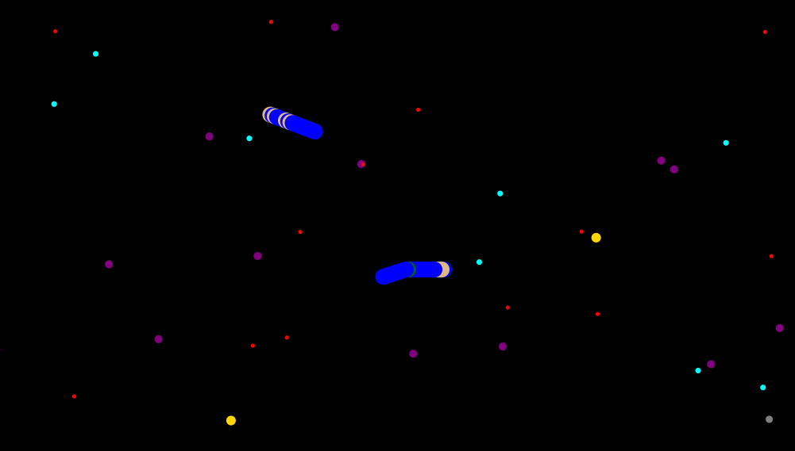

# Slither

[]()

Slither est notre projet de programmation pour le module de compléments de poo en premier semestre de la troisième 
année de la licence, c'est une implementation en java du jeu slither.io avec des règles personnalisées en plus.



## Table des Matières

- [Introduction](#introduction)
- [Caractéristiques](#caractéristiques)
- [Usage](#usage)
- [Tests](#tests)
- [Contribution](#contribution)

## Introduction

Ce projet consiste en un jeu de serpents (inspiré de l’antique jeu Snake,
revisité à la façon du site slither.io).

## Caractéristiques

- Le jeu peut être lancé avec un mode solo où un seul joueur contrôle un
serpent en utilisant la souris, ou avec un mode 2 joueurs où l'un contrôle 
son serpent avec la souris et l'autre avec les touches (haut, bas, droite, gauche) du clavier
avec deux écrans différents pour chaque joueur et une caméra qui suit le serpent de chacun des
deux joueurs
- Les joueurs ont le choix pour le nombre de serpents IAs à inclure dans la partie et
le nombre de nourritures durant la partie 
- Le terrain est sans bords et les déplacements sont fluides
- Le jeu propose plusieurs natures et types de nourritures qui permettent d'ajouter plusieurs
types de segments pour le joueur et en fonction de ces segments les collisions entre ces derniers 
peut avoir plusieurs effets sur le serpent victime et le serpent qui a causé la collision, parmi les 
nourritures et les segments que le jeu propose :
  - Des nourritures en <span style="color:cyan">cyan</span> qui permettent au serpent qui les mange de gagner des points vitesse 
  et qui peut utiliser pendant la partie pour augmenter sa vitesse en cliquant et en maintenant le 
  bouton gauche de la souris
  - Des nourritures en <span style="color:red">rouge</span> qui sont des poisons qui font décrémenter la taille du serpent d'un segment (celui en tête)
  - Des nourritures en <span style="color:gold">jaune</span> qui sont des boucliers et qui permettent s'ils sont placés en tête et que le serpent 
  rentre en collision avec un autre serpent de ne pas mourir (ce qui est le comportement par défaut de la collision 
  avec un autre segment), mais juste de perdre ce segment et de se régénérer et revenir à sa position où il a commencé 
  la partie
  - Des nourritures en <span style="color:purple">violet</span> qui sont des nourritures simples qui font augmenter la taille du serpent d'un segment simple.
  - Des nourritures en <span style="color:gray">gris</span> qui sont des nourritures ponts qui génére des segments faibles si un serpent les mange et 
  si un serpent rentre en collision avec un segment d'un serpent de ce type (segment faible) alors le serpent qui a causé 
  la collision ne va pas mourir et le serpent victime sera coupé à partir de la position de ce segment et va perdre tous 
  ses segments à partir de cette position
- Le nombre de nourritures peut être choisi dans le menu de début de la partie ensuite, elle provient de la mort d'un serpent 
- Le terrain est sans bords, mais il y a comme même une limite qui est imposé qui est la taille de la carte du jeu qui est limitée
par un rectangle noir qui recouvre la zone du jeu 

## Usage

Pour compiler le projet, tapez la commande suivante dans votre shell
```bash
    ./gradlew build
```

Pour lancer le jeu, utilisez la commande
```bash
    ./gradlew run
```

Pour lancer les tests, utilisez la commande
```bash
    ./gradlew test
```

## Tests

Le projet fournit un jeu de test sur le model du jeu et plus spécifiquement sur le système de
déplacement du serpent, la gestion de la croissance du serpent, le système de gestion de collision 
et aussi la cohérence d'une partie, l'ensemble de tests peut être trouvé dans le dossier src/test

## contribution

Pour continuer à développer et à améliorer le jeu, vous pouvez le cloner en utilisant

```bash
    # Cloner le dépot pour contribuer au développement du projet
    git clone https://gaufre.informatique.univ-paris-diderot.fr/tamdrari/slither.io.git
```
